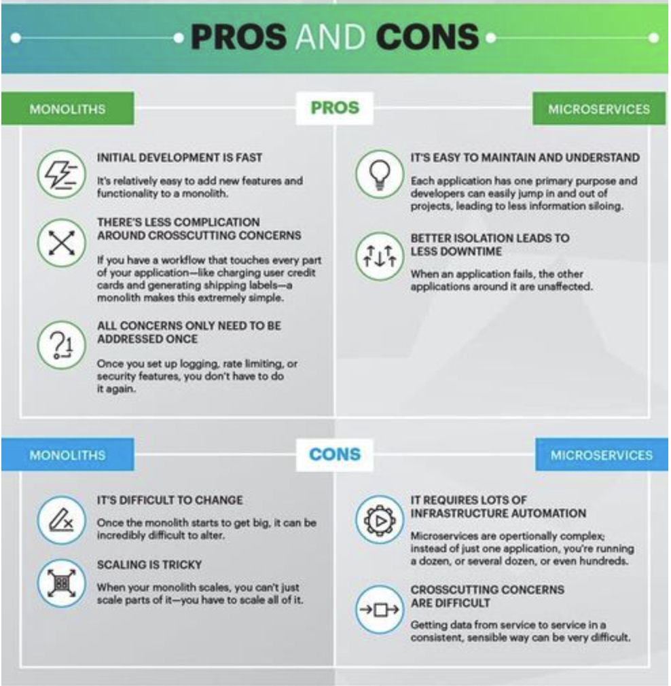
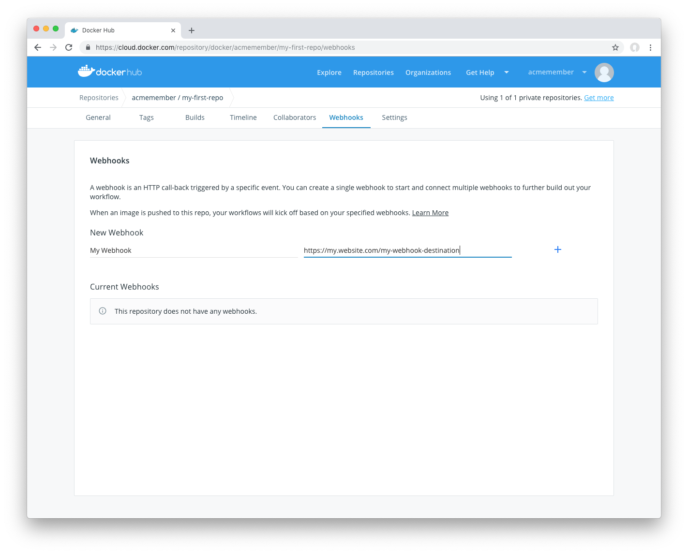

# Micorseverces Architecture vs Monolithlic Architecture

- A **monolithic application** is built as a single and indivisible unit. Usually, such a solution comprises a client-side user interface, a server side-application, and a database.

- A **Microservices architecture** breaks it down into a collection of smaller independent units. These units carry out every application process as a separate service. So all the services have their own logic and the database as well as perform the specific functions.



## Choosing a monolithic architecture
- **Small team**: If you are a startup and your team is small, you may not need to deal with the complexity of the microservices architecture. A monolith can meet all your business needs so there is no emergency to follow the hype and start with microservices.
- **A simple application**: Small applications which do not demand much business logic, superior scalability, and flexibility work better with monolithic architectures.
- **No microservices expertise**: Microservices require profound expertise to work well and bring business value. If you want to start a microservices application from scratch with no technical expertise in it, most probably, it will not pay off.
- **Quick launch**: If you want to develop your application and launch it as soon as possible, a monolithic model is the best choice. It works well when you aim to spend less initially and validate your business idea.

## Choosing a microservices architecture
- **Microservices expertise** Without proper skills and knowledge, building a microservice application is extremely risky. Still, just having the architecture knowledge is not enough. You need to have DevOps and Containers experts since the concepts are tightly coupled with microservices. Also, domain modelling expertise is a must. Dealing with microservices means splitting the system into separate functionalities and dividing responsibilities.
- **A complex and scalable application**:  The microservices architecture will make scaling and adding new capabilities to your application much easier. So if you plan to develop a large application with multiple modules and user journeys, a microservice pattern would be the best way to handle it.
- **Enough engineering skills**: Since a microservice project comprises multiple teams responsible for multiple services, you need to have enough resources to handle all the processes.

# Docker-Compose 

Using Compose is basically a three-step process:

1. Define your app’s environment with a Dockerfile so it can be reproduced anywhere.

2. Define the services that make up your app in docker-compose.yml so they can be run together in an isolated environment.

3. Run `docker compose up` and the Docker compose command starts and runs your entire app. Run `docker compose build` to update any changes to the docker compse file. 

### Apply microservices to the Node app and Mongodb

Lets define all services in a config file, that can spin up all the containers that we need 

1. Make a file called `docker-compose.yml`

```YAML
# Version of the compose file format 
version: "3.9"
# Container services
services:
  db:
  #  # image to fetch from docker hub
    image: mongo
    # Mapping of container port to host
    ports:
      - "27017:27017"
      # Mount volume 
    volumes:
      - "db:/data/db"

  app:
  # Path to Dockerfile 
    build: ./app
    restart: always
    ports:
      - "3000:3000"
    # Environment variables for startup script
    # container will use these variables
    # to start the container with these define variables. 
    environment:
      - DB_HOST=mongodb://db:27017/posts
    depends_on:
      - db
    # links:
    #     - ""
```

2. Run `docker compose up` 

### Docker webhook
Webhooks are POST requests sent to a URL you define in Docker Hub.

To create a webhook, visit the webhooks tab for your repository. Then:

- Provide a name for the webhooks
- Provide a destination webhook URL. This is where webhook POST requests will be delivered:

